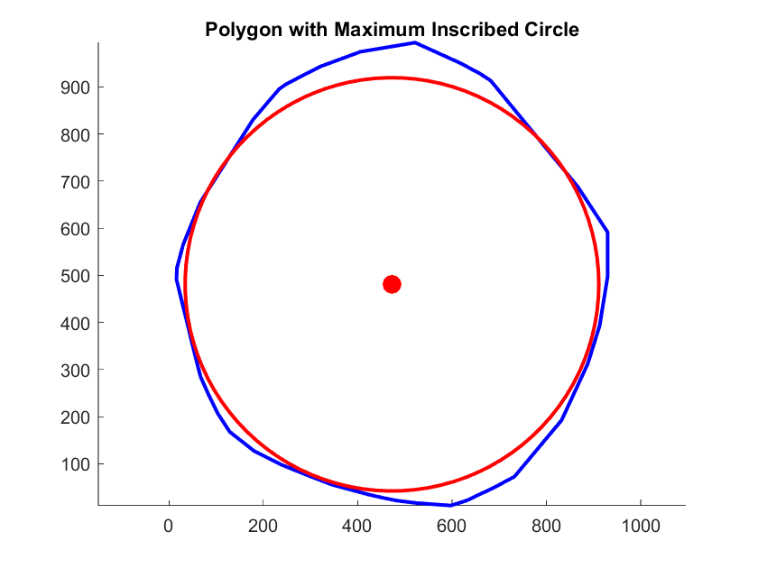

## Excercise 05
Ermitteln Sie für ein vorgegebenes konvexes Polygon ( polygon.txt und testpolygon.txt) mit Linear Programming den grössten einbeschreibbaren Kreis. Verwenden Sie zur Formulierung und Lösung des Problems entweder (vorzugsweise) MATLAB oder einen Online-Löser aus dem Internet.

### Result
**Center**: (472.570536, 480.865619)  
**Radius**: 438.592170

